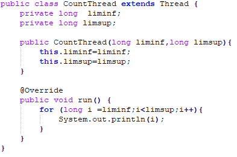
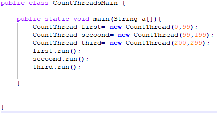
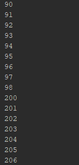
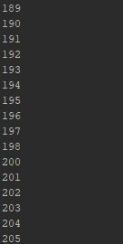
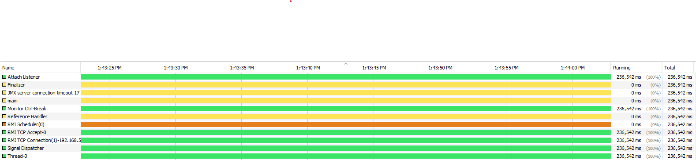
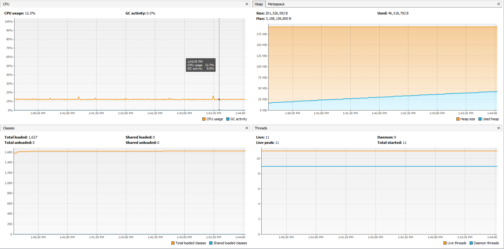
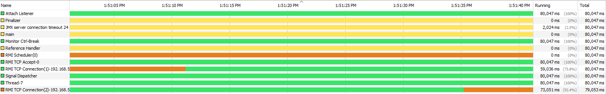
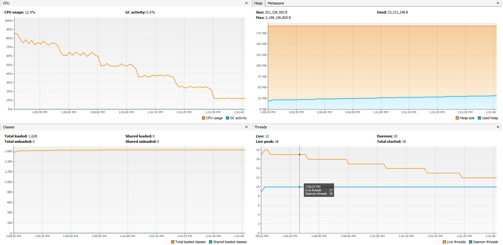
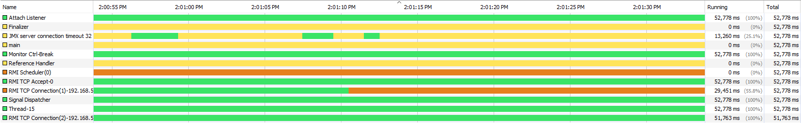
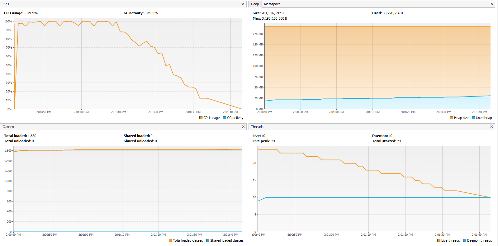

# Laboratorio #1

**Estudiantes:** 
+ Carlos Manuel Murillo Ibañez
+ Juan Camilo Rojas Ortiz

## Compile and run instructions.
+ **Para compilar:** maven package
+ **Para ejecutar la clase principal:** mvn exec:java -Dexec.mainClass="edu.eci.arsw.math.Main"
+ **Para ejecutar las pruebas:** mvn test

## Part I - Introduction to Java Threads
1. Se completó la implementación adecuada de la clase CountThread: 

2. Se completo la implementación adecuada de la clase CountMainThreads: 

Al iniciar los threads con la función start() se obtuvieron los siguientes resultados:

Al iniciar los threads con la función run() se obtuvieron los siguientes resultados:

+ Change the beginning with start() to run(). How does the output change? Why?  
Cuando iniciamos la ejecución de los tres Threads con el metodo start() pudimos 
notar que no tenia un orden predeterminado para la ejecución de los tres, en cambio 
con el metodo run() los tres Threads se ejecutan en el orden en que es ejecutada la linea.

## Part III - Performance Evaluation

#### 1. Un hilo
6 min 49 sec

#### 2. Tantos hilos como procesadores(8)
1 min 37 sec

#### 3. El doble de hilos que de procesadores
1 min 09 sec

#### 4. Con 200 hilos

#### 5. Con 500 hilos